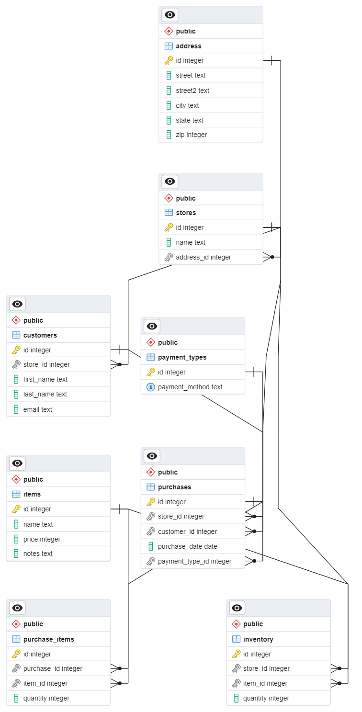

# Postgres Project

## Setup Instructions
1. Download **project_dump.backup** file
2. After creating a new database in pgAdmin, right click on newly created database, then click `Restore`
3. Leave `Format` as "Custom or tar"
4. In the `Filename` selector, find and select **project_dump.backup**
5. Leave `Number of jobs` empty
6. For `Role Name`, click the drop-down and select **postgres**
7. Click `Restore` at the bottom to restore

## Description

### Project Background:

A chain of high end membership-only stores has a database of records about purchases that is used by their corporate office. In the long term, corporate is interested in developing targeted ad campaigns to drive sales. To that end, corporate has asked for a series of queries in order to organize this data and answer some marketing questions. You have been provided with a database dump that should be used as is (no new tables, columns, stored procedures etc.) to meet the following requirements using new queries.
This project is based on the postgres project TEMPLATE. Please clone that repository to get started.

### Project Requirements:

| # | User Story | Requirements| Status| 
| --- | ------ | ----- | ---|
| 1 | As an owner, I want a query to view the following information from all stores, so that I can remember where all my stores are located. | Store Name <br /> Store Address <br /><br /> Order by Store Name| :white_check_mark: |
| 2 | As an auditor, I want a query to view the following information from all stores, so that I can quickly view sales per store. | Store Name <br/> Total sales in dollars <br/><br/>Order by Store Name | :white_check_mark: |
|3| As a marketing director, I want a query to view the store name and member name from all stores, so that I can provide targeted ad campaigns to specific individuals. | Store name <br/>Member name<br/><br/>Order by Store Name|:white_check_mark: |
|4| As the store manager of the Administaff, Inc., I want a query to view the inventory info from my specific store (only information about Administaff), so that I can quickly see my store's inventory|Store Name<br/> Item Name<br/>Quantity in this store<br/>Price per unit <br/>Notes about the unit<br/><br/>Ordered by Item Name|:white_check_mark:|
|5| As the store manager of the Administaff, Inc., I want a query to view the total sales by month from my specific store (only information about Administaff), so that I can request additional inventory before the high dollar sales months|Month of Purchase<br/>Total Sales<br/><br/>Order by month ascending|:white_check_mark:| 
|6| As an auditor who is currently auditing Benchmark Electronics, Inc., I want a query to view the payment type information about Benchmark Electronics, Inc. so that I can verify that those store managers are properly reporting cash payments.|Store Name<br/>Payment method<br/>Count of Purchases by Payment Method<br/><br/>Order by Payment Method Name|:white_check_mark:|
|7| As a regional inventory manager, I want a query to view low inventory (Fewer than 10) items by store, so that I can ship out more items to stores that need them.|Store Name<br/>Item Name<br/>Quantity of Item in that Store<br/><br/>Order by Store Name|:white_check_mark:|
|8| As a sales representative in a returns department, I want a query to see Alfred’s purchase history.| Member’s first and last name<br/>Purchase date<br/>Name of Item Purchased (single record per item name)<br/>Name of Payment Method used<br/>Quantity of Items Purchased<br/><br/>Order by Purchase Date, newest to oldest | :white_check_mark: |
|9| As a corporate manager, I want a query to update all of our past purchases that used Apple Pay to become purchases made using Credit.| | :white_check_mark: |
|10|As a corporate manager, I want to remove Apple Pay from the list of payment types as it is no longer supported by our company.| | :white_check_mark: |
|11| As a marketing director, I want a query that will add a new item to our stores.| Item Details: Name= "Frosted Flakes" <br/> Price = 5 <br/> Notes = "“They’re Grate!" | :white_check_mark: |
|12| As a regional inventory manager, I want a single query to add 50 of the new Frosted Flakes items to every store with a name containing the letter “a”. | | :white_check_mark: |
|13|As a corporate manager, I want to fix a mistake that our marketing director made. I want a query that will update the notes on one of our products |Product Name = "Frosted Flakes" <br/> Incorrect (current) Notes - “They’re Grate!” <br/>Correct Notes (please update to this) - “They’re Gr-r-reat!”|:white_check_mark:|
|14| In the “Relational Databases” section of the README, name all foreign key relationships in this database,including the table name of the original table, the foreign key field name, and the table that that foreign key points.| One foreign key relationship has been provided in the template README, please follow this format.| :white_check_mark: |
|15| In the section labeled Multiple Choice, answer the questions provided.|Just the number answer would be fine, or you can highlight the correct answer or remove all of the other ones, as long as it is clearly indicated which answer you chose.| :white_check_mark: |

| Nonfunctional Requirements | |
|---|---|
| 1. Contains the original database backup dump.|:heavy_check_mark: |
| 2. Contains all queries in one file in .sql or .txt format | :heavy_check_mark: |
| 3. Contains an Entity Relationship Diagram. | :heavy_check_mark: |
| 4. Contains a README.md file in the project root folder with instructions on how to load your dump file in either pgAdmin or from the command line.| :heavy_check_mark: |
| 5. Does not contain queries with any hard coded IDs in them. | :heavy_check_mark: |
| 6. All columns should have clearly defined column names. | :heavy_check_mark: |

### Multiple Choice

#### 1. Users are not allowed to add items to purchases where the amount of items bought exceeds the amount of items in the store. This is because:

- [x] 1. There is a Trigger Function preventing new purchases that exceed the current inventory.
- [ ] 2. This will cause a Foreign Key Constraint Violation on the Inventory table.
- [ ] 3. There is a custom rule on the items table that prevents it from ever having a negative value for the field 'quantity'.
- [ ] 4. Users are actually allowed to add those purchases.
	
#### 2. Why will the following SQL statement not work in the stores database?

```sql
SELECT s.name AS "Store Name"
      ,a.street AS "Street Address"
      ,a.street2 AS "Suite"
      ,a.city AS "City"
      ,a.state AS "State"
      ,a.zip AS "Zip Code"
  FROM stores s
       INNER JOIN address a
               ON address_id = a.id
```
- [ ] 1. It is missing a semi-colon.
- [ ] 2. Double-quotes do not work with column names with pgAdmin and postgres. 
- [ ] 3. address_id is an ambiguous field because it is not qualified with a table or alias name (should be s.address_id or stores.address_id).
- [x] 4. This is a valid query that will run without error.

#### 3. What is the relationship between the stores and customers tables?

- [ ] 1. Stores is a one-to-one relationship with Customers.
- [x] 2. Stores is a one-to-many relationship with Customers.
- [ ] 3. Stores is a many-to-many relationship with Customers.
- [ ] 4. Stores and Customers are unrelated tables.

#### 4. What is the relationship between the purchases and items tables?

- [ ] 1. The tables have a many-to-many relationship with the purchase_items table acting as a mapping table.
- [ ] 2. Purchases has a one-to-many relationship with items, as a single purchase can have multiple items in it.
- [ ] 3. Items has a one-to-many relationship with purchases, as a single item can have multiple purchases.
- [x] 4. Purchases and Items are unrelated tables.


## Relational Databases

### Foreign Key Relationships

| Table Name  | Foreign Key (FK) Name  | Table Matching FK |
| --- | --- | --- |
| customers | store_id | stores |
| inventory | item_id  | items  |
| inventory | store_id | stores |
| purchase_items | item_id | items|
| purchase_items | purchase_id | purchases|
| purchases | customer_id | customers |
| purchases | payment_type_id | payment_type|
| purchases | store_id | stores |
| stores | address_id | address|

### Entity Relationship Diagram



